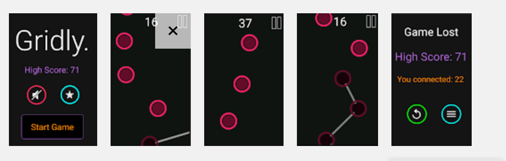

# Gridly

Gridly Mobile App for Android

Main code can be found in Gridly/app/src/main/java/shevrlx/gridly/.

Description: "Grid.ly is a game with one goal: connect all the dots. Connect the dots by dragging your finger across the screen, or just tapping on them. The dots keep going faster and faster, and the scores keep getting higher and higher..."

Game written in Java using Android Studio, uses threads for game loop
